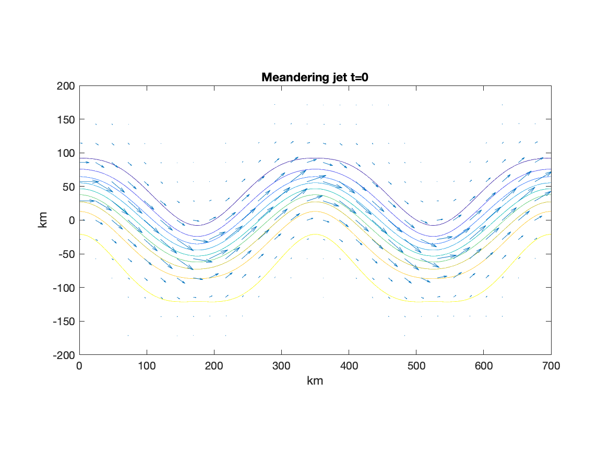
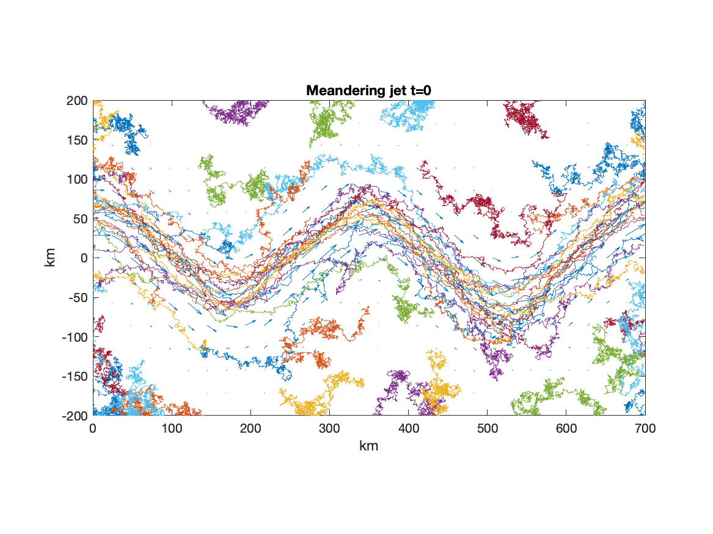

# A package for modeling and estimating advection-diffusion
## The AlongTrack Simulator returns the ground track sampling pattern for all of the current and historical altimetry missions.

- [Install](installation) the Matlab package
- Read the [Getting Started](getting-started) guide

---


Start by initializing and visualizing a kinematic model,
```matlab

jet = MeanderingJet();
figure
jet.plotStreamfunction(), hold on
jet.plotVelocityField()
```
<p align="left"></p>
This meandering jet example is bounded in the y-direction, and periodic in the x-direction.

Now that we have a `KinematicModel` initialized, we can use that in the `AdvectionDiffusionIntegrator`.
```matlab
kappa = 1e3;
integrator = AdvectionDiffusionIntegrator(jet,kappa);
```
Let's choose appropriate time scales to integrate
```matlab
T = 5*jet.Lx/jet.U;
dt = 864;
```
and place particles throughout the valid domain
```matlab
x = linspace(min(jet.xlim),max(jet.xlim),6);
y = linspace(min(jet.ylim),max(jet.ylim),6);
[x0,y0] = ndgrid(x,y);
```
Finally, we now use the integrator to generate some trajectories
```matlab
[t,x,y] = integrator.particleTrajectories(x0,y0,T,dt);

figure
jet.plotVelocityField(), hold on
jet.plotTrajectories(x,y)
```
<p align="left"></p>
