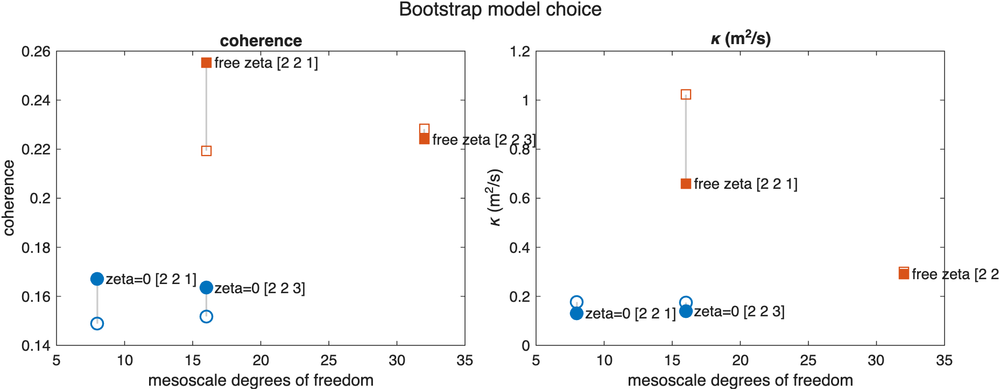

# Bootstrap error assessment and model choice

Use Site 1 bootstrap gridded-streamfunction fits to assess uncertainty, inspect restart files, and compare candidate models.

Source: `Examples/Tutorials/BootstrapErrorAssessmentAndModelChoice.m`

## Load the Site 1 drifters

Whole-drifter bootstrapping resamples the observed drifters with
replacement, refits `GriddedStreamfunction` for each resample, and then
uses the bootstrap cloud to estimate how sensitive the recovered
mesoscale diagnostics are to the finite drifter cluster.

`GriddedStreamfunctionBootstrap` wraps that workflow around
`GriddedStreamfunction`: `fullFit` is the deterministic fit to the full
Site 1 cluster, each bootstrap replicate is another
`GriddedStreamfunction` fit, and the class stores COM-local summaries and
restart metadata so the ensemble can be reloaded later without refitting.

```matlab
scriptDir = fileparts(mfilename("fullpath"));
jlabPath = fullfile(scriptDir, "..", "..", "..", "jLab");
if isfolder(jlabPath)
    addpath(genpath(jlabPath));
end

dataPath = fullfile(scriptDir, "..", "..", "Estimation", "ExampleData", "LatMix2011", "smoothedGriddedRho1Drifters.mat");
if ~isfile(dataPath)
    error("BootstrapErrorAssessmentAndModelChoice:MissingExampleData", ...
        "Expected local example data at %s.", dataPath);
end

siteData = load(dataPath);
t = reshape(siteData.t, [], 1);
x = siteData.x(:, 1:(end - 1));
y = siteData.y(:, 1:(end - 1));
tDays = t/86400;
nDrifters = size(x, 2);
f0 = 2 * 7.2921e-5 * sin(siteData.lat0*pi/180);
```

## Convert the drifters to trajectory splines

Each drifter becomes one `TrajectorySpline`, matching the deterministic
fit tutorial and giving every bootstrap replicate the same position and
velocity interface.

```matlab
trajectories = trajectorySplinesFromObservedPositions(t, x, y);
```

## Build a 200-member bootstrap ensemble

This tutorial uses the same zero-vorticity mesoscale model family as the
Site 1 fit tutorial, but repeats the whole fit on 200 whole-drifter
resamples.

```matlab
bootstrap = GriddedStreamfunctionBootstrap.fromTrajectories( ...
    trajectories, nBootstraps=200, randomSeed=0, queryTimes=t, ...
    scoreStride=6, psiS=[2 2 1], fastS=3, mesoscaleConstraint="zeroVorticity");
summary = bootstrap.summary;

nBootstrapRowsToShow = min(5, bootstrap.nBootstraps);
bootstrapIndexTable = array2table( ...
    bootstrap.bootstrapIndices(1:nBootstrapRowsToShow, :), ...
    VariableNames=cellstr(compose("drifter%d", 1:nDrifters)));
bootstrapIndexTable = addvars( ...
    bootstrapIndexTable, ...
    (1:nBootstrapRowsToShow).', ...
    Before=1, ...
    NewVariableNames="bootstrapSample");

fprintf("Site 1 bootstrap ensemble\n");
fprintf("  drifters: %d\n", nDrifters);
fprintf("  bootstraps: %d\n", bootstrap.nBootstraps);
fprintf("  stored summaries: %d query times x %d replicates\n", size(summary.sigma_n, 1), size(summary.sigma_n, 2));
disp(bootstrapIndexTable)
```

## Relate the ensemble back to GriddedStreamfunction

`fullFit` is the deterministic all-drifter solution. `bestFit()`
reconstructs the top-ranked bootstrap replicate, `fitForBootstrap(i)`
reconstructs any stored replicate from its saved metadata, and
`scores.joint` ranks the replicates by consensus within the bootstrap
cloud.

```matlab
fullFit = bootstrap.fullFit;
fullSummary = bootstrap.fullSummary;
scores = bootstrap.scores;
[~, rankedIndices] = sort(scores.joint, "descend");
iBest = bootstrap.bestBootstrapIndex();
bestFit = bootstrap.bestFit();
bestFitFromMetadata = bootstrap.fitForBootstrap(iBest);

nRankedToShow = min(5, bootstrap.nBootstraps);
rankedIndicesToShow = reshape(rankedIndices(1:nRankedToShow), [], 1);
rankedTable = table( ...
    rankedIndicesToShow, ...
    reshape(scores.joint(rankedIndicesToShow), [], 1), ...
    reshape(scores.uv(rankedIndicesToShow), [], 1), ...
    reshape(scores.strain(rankedIndicesToShow), [], 1), ...
    reshape(scores.zeta(rankedIndicesToShow), [], 1), ...
    VariableNames=["bootstrapIndex", "jointScore", "uvScore", "strainScore", "zetaScore"]);
disp(rankedTable)

xCenterFull = fullFit.centerOfMassTrajectory.x(t);
yCenterFull = fullFit.centerOfMassTrajectory.y(t);
xCenterBest = bestFit.centerOfMassTrajectory.x(t);
yCenterBest = bestFit.centerOfMassTrajectory.y(t);
xCenterBestFromMetadata = bestFitFromMetadata.centerOfMassTrajectory.x(t);
yCenterBestFromMetadata = bestFitFromMetadata.centerOfMassTrajectory.y(t);

fullSummarySigmaNDiff = max(abs(fullFit.sigma_n(t, xCenterFull, yCenterFull) - fullSummary.sigma_n));
bestSummarySigmaNDiff = max(abs(bestFit.sigma_n(t, xCenterBest, yCenterBest) - summary.sigma_n(:, iBest)));
bestMetadataCenterDiff = max(abs(xCenterBest - xCenterBestFromMetadata) + abs(yCenterBest - yCenterBestFromMetadata));

fprintf("  full-fit sigma_n summary mismatch: %.3e s^-1\n", fullSummarySigmaNDiff);
fprintf("  best-fit sigma_n summary mismatch: %.3e s^-1\n", bestSummarySigmaNDiff);
fprintf("  best-fit center-of-mass mismatch after fitForBootstrap: %.3e m\n", bestMetadataCenterDiff);
fprintf("  best bootstrap index: %d\n", iBest);
fprintf("  mesoscale degrees of freedom: %d\n", bootstrap.mesoscaleDegreesOfFreedom);
```

## Write and reload a bootstrap restart file

`writeToFile` saves the observed trajectories, bootstrap resampling
indices, COM-local summaries, consensus scores, and fit metadata into a
NetCDF restart file. `fromFile` reads that restart state back into a
working `GriddedStreamfunctionBootstrap` object without recomputing the
200-member ensemble.

```matlab
restartPath = tempname + ".nc";
cleanupRestart = onCleanup(@() deleteFileIfExists(restartPath));

restartFile = bootstrap.writeToFile(restartPath, shouldOverwriteExisting=true);
restartFile.close();
clear restartFile
restartInfo = ncinfo(restartPath);
restartGroup = restartGroupInfo(restartInfo, "GriddedStreamfunctionBootstrap");
restartVariableNames = string({restartGroup.Variables.Name}).';
restartVariableNames = restartVariableNames(1:min(14, numel(restartVariableNames)));
restartFileInfo = dir(restartPath);

fprintf("  restart file: %s\n", restartPath);
fprintf("  restart size: %.2f MB\n", restartFileInfo.bytes/1024^2);
disp(restartVariableNames)

bootstrapRestart = GriddedStreamfunctionBootstrap.fromFile(restartPath);
if any(abs(bootstrapRestart.queryTimes - bootstrap.queryTimes) > 1e-12)
    error("BootstrapErrorAssessmentAndModelChoice:RestartQueryTimesMismatch", ...
        "Restarted queryTimes do not match the written ensemble.");
end
if any(abs(bootstrapRestart.summary.sigma_n - bootstrap.summary.sigma_n) > 1e-12, "all")
    error("BootstrapErrorAssessmentAndModelChoice:RestartSummaryMismatch", ...
        "Restarted sigma_n summaries do not match the written ensemble.");
end
if any(abs(bootstrapRestart.scores.joint - bootstrap.scores.joint) > 1e-12)
    error("BootstrapErrorAssessmentAndModelChoice:RestartScoreMismatch", ...
        "Restarted joint scores do not match the written ensemble.");
end
if bootstrapRestart.bestBootstrapIndex() ~= bootstrap.bestBootstrapIndex()
    error("BootstrapErrorAssessmentAndModelChoice:RestartBestIndexMismatch", ...
        "Restarted best-bootstrap index does not match the written ensemble.");
end

bootstrap = bootstrapRestart;
fullFit = bootstrap.fullFit;
fullSummary = bootstrap.fullSummary;
bestFit = bootstrap.bestFit();
```

## Summarize the stored uncertainty bands

`summaryQuantiles` turns the stored bootstrap cloud into simple 16/50/84%
bands for the COM-local diagnostics and for the scalar bootstrap
diffusivity and coherence diagnostics.

```matlab
evalc("quantiles = bootstrap.summaryQuantiles([0.16 0.5 0.84]);");

fprintf("  kappa 16/50/84%%: %.3f, %.3f, %.3f m^2/s\n", quantiles.kappa(1), quantiles.kappa(2), quantiles.kappa(3));
if all(isfinite(quantiles.coherence))
    fprintf("  coherence 16/50/84%%: %.3f, %.3f, %.3f\n", ...
        quantiles.coherence(1), quantiles.coherence(2), quantiles.coherence(3));
else
    fprintf("  coherence diagnostics are unavailable until jLab's sleptap and mspec functions are on the MATLAB path.\n");
end
```

## Plot the bootstrap strain KDEs

A KDE in the `(\sigma_n,\sigma_s)` plane shows how the bootstrap cloud
moves through time. The black dashed curves are the full-data fit, while
the colored band shows the 68% contour support recovered from the
bootstrap ensemble.

```matlab
requestedDisplayDays = [0 2 4 6];
strainKDE = strainKDESummaries(bootstrap, f0, requestedDisplayDays);
fullSigma = hypot(fullSummary.sigma_n, fullSummary.sigma_s)/f0;
fullThetaDegrees = GriddedStreamfunction.visualPrincipalStrainAngle(fullSummary.sigma_n, fullSummary.sigma_s);

figure(Color="w", Position=[100 100 760 860]);
tlError = tiledlayout(4, 2, TileSpacing="compact", Padding="compact");
cmap = parula(256);
cmap(1, :) = 1;
colormap(cmap);

for iPanel = 1:numel(strainKDE.displayDays)
    ax = nexttile(tlError, iPanel);
    sigmaSamples = [ ...
        reshape(strainKDE.sigmaN(strainKDE.timeIndices(iPanel), :), [], 1), ...
        reshape(strainKDE.sigmaS(strainKDE.timeIndices(iPanel), :), [], 1)];
    KernelDensityEstimate.plotPlanarStatistics( ...
        ax, ...
        strainKDE.statisticsSeries{strainKDE.timeIndices(iPanel)}, ...
        samples=sigmaSamples, ...
        contourMasses=strainKDE.contourMasses, ...
        showWedge=~strainKDE.strainSummarySeries{strainKDE.timeIndices(iPanel)}.containsZero, ...
        scatterColor=[0 0.4470 0.7410], ...
        wedgeColor=0.5 * [1 1 1], ...
        wedgeAlpha=0.35, ...
        wedgeResolution=100, ...
        ringRadii=strainKDE.ringRadii, ...
        ringColor=0.75 * [1 1 1], ...
        ringLineStyle=":", ...
        ringLineWidth=0.8);
    axis(ax, "equal")
    xlabel(ax, "\sigma_n / f_0")
    ylabel(ax, "\sigma_s / f_0")
    text(ax, 0.03, 0.97, sprintf("day %.1f", strainKDE.matchedTimeDays(iPanel)), ...
        Units="normalized", HorizontalAlignment="left", VerticalAlignment="top", ...
        Color=[0.2 0.2 0.2]);
    box(ax, "on")
end

axSigma = nexttile(tlError, 5, [1 2]);
sigmaBand = fill( ...
    axSigma, ...
    [strainKDE.tDays; flipud(strainKDE.tDays)], ...
    [strainKDE.sigmaBounds(:, 2); flipud(strainKDE.sigmaBounds(:, 1))], ...
    [0 0.4470 0.7410], ...
    EdgeColor="none", ...
    FaceAlpha=0.22);
hold(axSigma, "on")
sigmaModeLine = plot(axSigma, strainKDE.tDays, strainKDE.modeSigma, Color=[0 0.4470 0.7410], LineWidth=1.5);
sigmaFullLine = plot(axSigma, strainKDE.tDays, fullSigma, "k--", LineWidth=1.3);
arrayfun(@(day) xline(axSigma, day, ":", Color=0.85 * [1 1 1], HandleVisibility="off"), strainKDE.matchedTimeDays);
ylabel(axSigma, "\sigma / f_0")
xlim(axSigma, [tDays(1), tDays(end)])
legend(axSigma, [sigmaModeLine, sigmaBand, sigmaFullLine], "KDE mode", "68% contour band", "full fit", Location="northwest")
box(axSigma, "on")

axTheta = nexttile(tlError, 7, [1 2]);
fill( ...
    axTheta, ...
    [strainKDE.tDays; flipud(strainKDE.tDays)], ...
    [strainKDE.thetaBoundsDegrees(:, 2); flipud(strainKDE.thetaBoundsDegrees(:, 1))], ...
    [0 0.4470 0.7410], ...
    EdgeColor="none", ...
    FaceAlpha=0.22);
hold(axTheta, "on")
plot(axTheta, strainKDE.tDays, strainKDE.modeThetaDegrees, Color=[0 0.4470 0.7410], LineWidth=1.5)
plot(axTheta, strainKDE.tDays, fullThetaDegrees, "k--", LineWidth=1.3)
arrayfun(@(day) xline(axTheta, day, ":", Color=0.85 * [1 1 1], HandleVisibility="off"), strainKDE.matchedTimeDays);
xlabel(axTheta, "time (days)")
ylabel(axTheta, "\theta (deg)")
xlim(axTheta, [tDays(1), tDays(end)])
box(axTheta, "on")

title(tlError, "Bootstrap error assessment")
```


*Whole-drifter bootstrap KDEs show how the recovered Site 1 strain state moves through `(\sigma_n,\sigma_s)` space, while the time-series panels compare the full-data fit against the dominant 68% bootstrap support.*

## Compare a small set of candidate models

Model choice compares several plausible mesoscale model families and
weighs diagnostic performance against complexity. Here the candidates
differ in the mesoscale spline time dependence and in whether the hard
zero-vorticity constraint is enforced. For broader model-selection ideas
such as AIC, BIC, likelihood-ratio tests, and cross-validation, see
[model selection](https://en.wikipedia.org/wiki/Model_selection).

```matlab
candidatePsiS = [2 2 1; 2 2 3];
candidateConstraints = ["zeroVorticity", "none"];
nCandidateBootstraps = 12;
nCandidateModels = size(candidatePsiS, 1) * numel(candidateConstraints);

psiSLabels = strings(nCandidateModels, 1);
mesoscaleConstraintLabels = strings(nCandidateModels, 1);
candidateLabels = strings(nCandidateModels, 1);
mesoscaleDegreesOfFreedom = NaN(nCandidateModels, 1);
fullFitKappa = NaN(nCandidateModels, 1);
bestFitKappa = NaN(nCandidateModels, 1);
fullFitCoherence = NaN(nCandidateModels, 1);
bestFitCoherence = NaN(nCandidateModels, 1);

iModel = 0;
for iConstraint = 1:numel(candidateConstraints)
    mesoscaleConstraint = candidateConstraints(iConstraint);
    for iPsiS = 1:size(candidatePsiS, 1)
        iModel = iModel + 1;
        psiS = candidatePsiS(iPsiS, :);
        evalc([ ...
            'candidateBootstrap = GriddedStreamfunctionBootstrap.fromTrajectories(' ...
            'trajectories, nBootstraps=nCandidateBootstraps, randomSeed=0, ' ...
            'queryTimes=t, scoreStride=6, psiS=psiS, fastS=3, ' ...
            'mesoscaleConstraint=mesoscaleConstraint);']);

        psiSLabels(iModel) = "[" + join(string(psiS), " ") + "]";
        mesoscaleConstraintLabels(iModel) = mesoscaleConstraint;
        if mesoscaleConstraint == "zeroVorticity"
            candidateLabels(iModel) = "zeta=0 " + psiSLabels(iModel);
        else
            candidateLabels(iModel) = "free zeta " + psiSLabels(iModel);
        end
        mesoscaleDegreesOfFreedom(iModel) = candidateBootstrap.mesoscaleDegreesOfFreedom;
        fullFitKappa(iModel) = candidateBootstrap.fullFitKappa;
        bestFitKappa(iModel) = candidateBootstrap.bestFitKappa;
        fullFitCoherence(iModel) = candidateBootstrap.fullFitCoherence;
        bestFitCoherence(iModel) = candidateBootstrap.bestFitCoherence;
    end
end

diagnosticsTable = table( ...
    psiSLabels, ...
    mesoscaleConstraintLabels, ...
    candidateLabels, ...
    mesoscaleDegreesOfFreedom, ...
    fullFitKappa, ...
    fullFitCoherence, ...
    bestFitKappa, ...
    bestFitCoherence, ...
    VariableNames=["psiS", "mesoscaleConstraint", "label", "mesoscaleDegreesOfFreedom", "fullFitKappa", "fullFitCoherence", "bestFitKappa", "bestFitCoherence"]);
diagnosticsTable = sortrows(diagnosticsTable, ["mesoscaleConstraint", "psiS"]);
disp(diagnosticsTable)

figure(Color="w", Position=[100 100 900 360]);
tlModelChoice = tiledlayout(1, 2, TileSpacing="compact", Padding="compact");

axCoherence = nexttile;
hasFiniteCoherence = any(isfinite(diagnosticsTable.fullFitCoherence)) || any(isfinite(diagnosticsTable.bestFitCoherence));
if hasFiniteCoherence
    plotCandidateComparison(axCoherence, diagnosticsTable, diagnosticsTable.label, diagnosticsTable.fullFitCoherence, diagnosticsTable.bestFitCoherence, "coherence");
else
    axis(axCoherence, "off")
    text(axCoherence, 0.5, 0.55, "Coherence diagnostics require jLab's sleptap and mspec functions.", ...
        Units="normalized", HorizontalAlignment="center", FontWeight="bold")
    text(axCoherence, 0.5, 0.38, "The diffusivity panel still compares the four candidate models.", ...
        Units="normalized", HorizontalAlignment="center")
    title(axCoherence, "Coherence unavailable")
end

axKappa = nexttile;
plotCandidateComparison(axKappa, diagnosticsTable, diagnosticsTable.label, diagnosticsTable.fullFitKappa, diagnosticsTable.bestFitKappa, "\kappa (m^2/s)");

title(tlModelChoice, "Bootstrap model choice")
```



*A small candidate sweep compares model complexity against the scalar bootstrap diagnostics. Open markers show the full-data fit and filled markers show the top-ranked bootstrap replicate for each candidate.*

