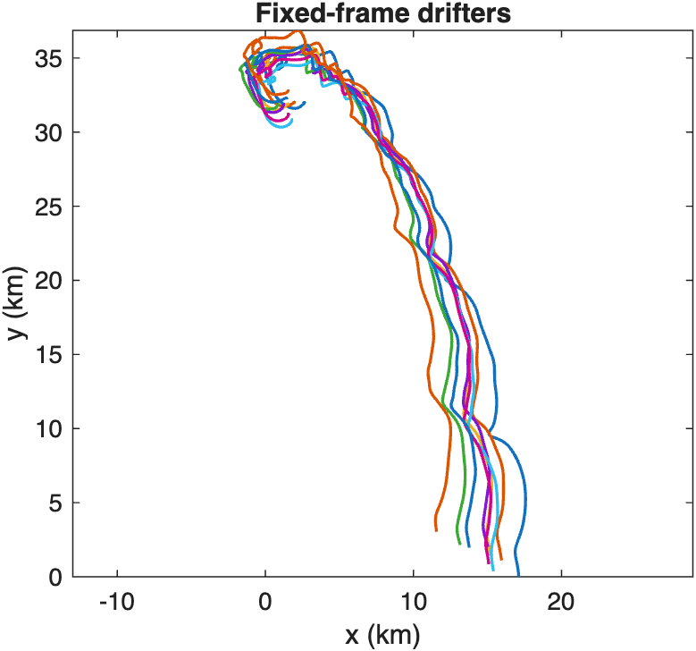
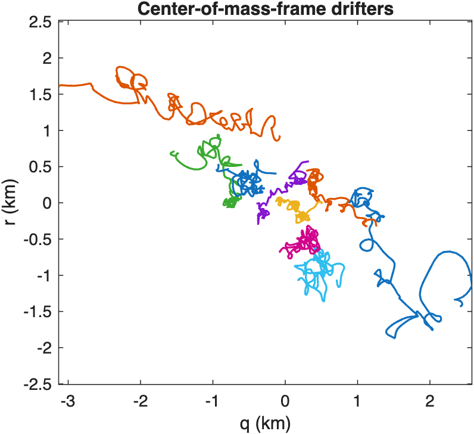
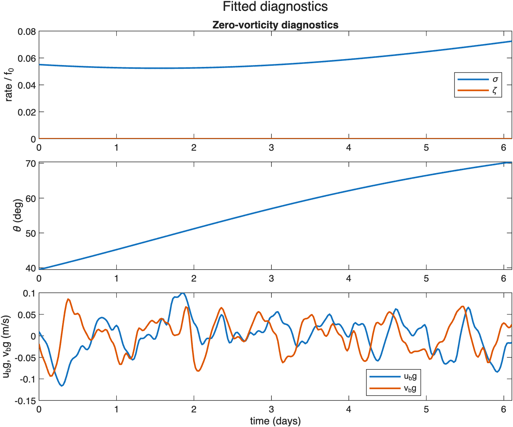
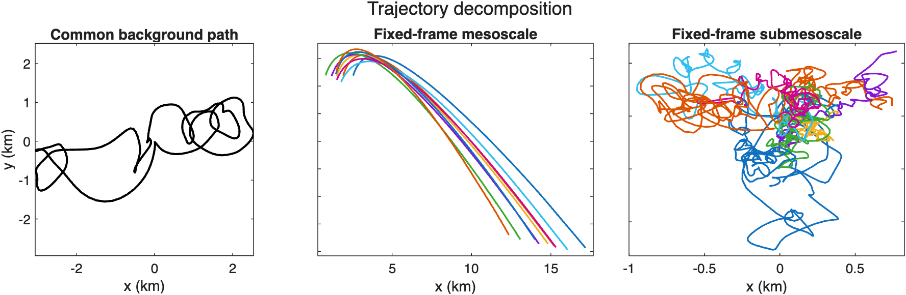
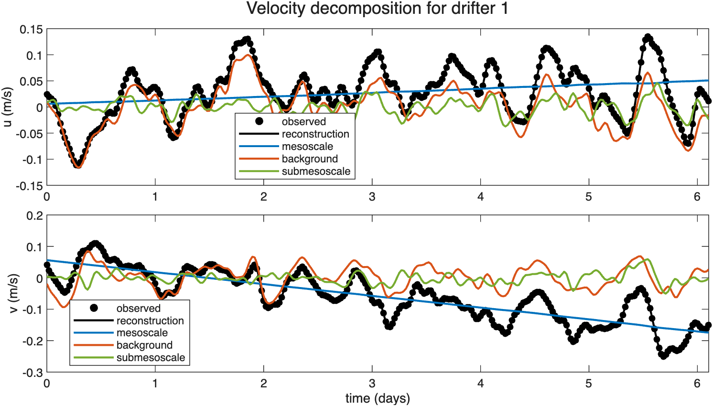

# Gridded streamfunction fit

Fit a zero-vorticity gridded streamfunction to the Site 1 LatMix drifter cluster and inspect the fitted decomposition.

Source: `Examples/Tutorials/GriddedStreamfunctionFit.m`

## Load the Site 1 drifters

`GriddedStreamfunction` fits one common background path, one centered
mesoscale streamfunction, and one submesoscale residual per drifter so
that

$$ \dot{x}_k = u^{\mathrm{meso}} + u^{\mathrm{bg}} + u_k^{\mathrm{sm}}, \qquad \dot{y}_k = v^{\mathrm{meso}} + v^{\mathrm{bg}} + v_k^{\mathrm{sm}}. $$

These are smoothed Site 1 LatMix trajectories in the fixed frame. The
goal is to separate the common cluster translation from the relative
motion within the cluster.

```matlab
scriptDir = fileparts(mfilename("fullpath"));
dataPath = fullfile(scriptDir, "..", "..", "Estimation", "ExampleData", "LatMix2011", "smoothedGriddedRho1Drifters.mat");
siteData = load(dataPath);
t = reshape(siteData.t, [], 1);
x = siteData.x(:, 1:(end - 1));
y = siteData.y(:, 1:(end - 1));
nDrifters = size(x, 2);
tDays = t/86400;
f0 = 2 * 7.2921e-5 * sin(siteData.lat0*pi/180);
```

## Plot the drifters in the fixed frame

These smoothed trajectories are shown in the fixed frame. The fit will
separate the common translation from the relative motion.

```matlab
figure(Color="w", Position=[100 100 430 360]); axFixed = axes; hold(axFixed, "on")
for iDrifter = 1:nDrifters
    plot(axFixed, x(:, iDrifter)/1000, y(:, iDrifter)/1000, LineWidth=1.2);
end
axis(axFixed, "equal"); xlabel(axFixed, "x (km)"); ylabel(axFixed, "y (km)")
title(axFixed, "Fixed-frame drifters"); box(axFixed, "on")
```



*These smoothed fixed-frame trajectories still combine the common cluster translation with the relative motion that the estimator will separate.*

## Build the centered zero-vorticity fit

Each drifter is first represented as a cubic `TrajectorySpline`, then
the fit is built directly from those splines with
[`fromTrajectories`](../classes/estimators/gridded-streamfunction/griddedstreamfunction/fromtrajectories).
The key control is
[`psiS`](../classes/estimators/gridded-streamfunction/griddedstreamfunction/psis):
`psiS=[2 2 1]` makes the centered mesoscale streamfunction quadratic in
`q` and `r`, and linear in time, so the fit can represent a slowly
evolving strain field without becoming high order.
[`fastS`](../classes/estimators/gridded-streamfunction/griddedstreamfunction/fasts)
= `3` keeps the center-of-mass and background trajectories cubic in
time, and
[`mesoscaleConstraint`](../classes/estimators/gridded-streamfunction/griddedstreamfunction/mesoscaleconstraint)
= `"zeroVorticity"` removes solid-body rotation so the mesoscale fit is
harmonic and strain-dominated. See
[`centeredCoordinates`](../classes/estimators/gridded-streamfunction/griddedstreamfunction/centeredcoordinates)
for the matching COM-frame transform.

```matlab
trajectoryCell = cell(nDrifters, 1);
for iDrifter = 1:nDrifters
    trajectoryCell{iDrifter} = TrajectorySpline.fromData(t, x(:, iDrifter), y(:, iDrifter), S=3);
end
trajectories = vertcat(trajectoryCell{:});
fit = GriddedStreamfunction.fromTrajectories(trajectories, psiS=[2 2 1], fastS=3, mesoscaleConstraint="zeroVorticity");
decomposition = fit.decomposition;
```

## Move to the center-of-mass frame

The fitted center-of-mass trajectory defines the centered coordinates

$$ q_k = x_k - m_x(t), \qquad r_k = y_k - m_y(t), $$

which remove the common translation and leave the relative motion seen
by the mesoscale spline.

```matlab
figure(Color="w", Position=[100 100 430 360]); axCentered = axes; hold(axCentered, "on")
for iDrifter = 1:nDrifters
    trajectory = fit.observedTrajectories(iDrifter); ti = trajectory.t;
    [~, qi, ri] = fit.centeredCoordinates(ti, trajectory.x(ti), trajectory.y(ti));
    plot(axCentered, qi/1000, ri/1000, LineWidth=1.2);
end
axis(axCentered, "equal"); xlabel(axCentered, "q (km)"); ylabel(axCentered, "r (km)")
title(axCentered, "Center-of-mass-frame drifters"); box(axCentered, "on")
```



*Removing the fitted center-of-mass translation reveals the relative motion that the mesoscale streamfunction and residual decomposition must explain.*

## Evaluate diagnostics on the center-of-mass path

Evaluating the fit on the center-of-mass path gives a compact summary of
the recovered strain, background drift, and the near-zero mesoscale
vorticity implied by the chosen constraint.

```matlab
xCom = fit.centerOfMassTrajectory.x(t);
yCom = fit.centerOfMassTrajectory.y(t);
sigmaN = fit.sigma_n(t, xCom, yCom);
sigmaS = fit.sigma_s(t, xCom, yCom);
sigma = hypot(sigmaN, sigmaS);
zeta = fit.zeta(t, xCom, yCom);
thetaDegrees = GriddedStreamfunction.visualPrincipalStrainAngle(sigmaN, sigmaS);
uBackground = fit.uBackground(t);
vBackground = fit.vBackground(t);
```

## Plot the fitted diagnostics

```matlab
figure(Color="w", Position=[100 100 700 560]); tlDiagnostics = tiledlayout(3, 1, TileSpacing="compact", Padding="compact");

axRate = nexttile; hold(axRate, "on")
plot(axRate, tDays, sigma/f0, LineWidth=1.5); plot(axRate, tDays, zeta/f0, LineWidth=1.5)
ylabel(axRate, "rate / f_0"); xlim(axRate, [tDays(1), tDays(end)])
legend(axRate, "\sigma", "\zeta", Location="best"); box(axRate, "on"); title(axRate, "Zero-vorticity diagnostics")

axTheta = nexttile;
plot(axTheta, tDays, thetaDegrees, LineWidth=1.5)
ylabel(axTheta, "\theta (deg)"); xlim(axTheta, [tDays(1), tDays(end)]); box(axTheta, "on")

axBackground = nexttile; hold(axBackground, "on")
plot(axBackground, tDays, uBackground, LineWidth=1.5); plot(axBackground, tDays, vBackground, LineWidth=1.5)
xlabel(axBackground, "time (days)"); ylabel(axBackground, "u_bg, v_bg (m/s)")
xlim(axBackground, [tDays(1), tDays(end)]); legend(axBackground, "u_bg", "v_bg", Location="best"); box(axBackground, "on")

title(tlDiagnostics, "Fitted diagnostics")
```



*The zero-vorticity fit retains a time-varying strain field and background drift while keeping the mesoscale relative vorticity near zero along the fitted center-of-mass path.*

## Plot the fixed-frame decomposition

The fixed-frame decomposition stores a common background path together
with one mesoscale and one submesoscale trajectory for each drifter.

```matlab
backgroundX = fit.backgroundTrajectory.x(t);
backgroundY = fit.backgroundTrajectory.y(t);

figure(Color="w", Position=[100 100 960 290]); tlDecomposition = tiledlayout(1, 3, TileSpacing="compact", Padding="compact");
axBackgroundPath = nexttile;
plot(axBackgroundPath, backgroundX/1000, backgroundY/1000, "k", LineWidth=1.5)
axis(axBackgroundPath, "equal"); xlabel(axBackgroundPath, "x (km)"); ylabel(axBackgroundPath, "y (km)")
title(axBackgroundPath, "Common background path"); box(axBackgroundPath, "on")

axMesoscale = nexttile; hold(axMesoscale, "on")
mesoXMin = inf; mesoXMax = -inf; mesoYMin = inf; mesoYMax = -inf;
for iDrifter = 1:nDrifters
    trajectory = fit.observedTrajectories(iDrifter); ti = trajectory.t; mesoscale = decomposition.fixedFrame.mesoscale(iDrifter);
    xMeso = mesoscale.x(ti)/1000; yMeso = mesoscale.y(ti)/1000;
    mesoXMin = min(mesoXMin, min(xMeso)); mesoXMax = max(mesoXMax, max(xMeso));
    mesoYMin = min(mesoYMin, min(yMeso)); mesoYMax = max(mesoYMax, max(yMeso));
    plot(axMesoscale, xMeso, yMeso, LineWidth=1.2)
end
xlim(axMesoscale, [mesoXMin mesoXMax] + 0.03 * max(mesoXMax - mesoXMin, 1) * [-1 1])
ylim(axMesoscale, [mesoYMin mesoYMax] + 0.03 * max(mesoYMax - mesoYMin, 1) * [-1 1])
xlabel(axMesoscale, "x (km)"); title(axMesoscale, "Fixed-frame mesoscale"); axMesoscale.YTickLabel = []; box(axMesoscale, "on")

axSubmesoscale = nexttile; hold(axSubmesoscale, "on")
subXMin = inf; subXMax = -inf; subYMin = inf; subYMax = -inf;
for iDrifter = 1:nDrifters
    trajectory = fit.observedTrajectories(iDrifter); ti = trajectory.t; submesoscale = decomposition.fixedFrame.submesoscale(iDrifter);
    xSubmeso = submesoscale.x(ti)/1000; ySubmeso = submesoscale.y(ti)/1000;
    subXMin = min(subXMin, min(xSubmeso)); subXMax = max(subXMax, max(xSubmeso));
    subYMin = min(subYMin, min(ySubmeso)); subYMax = max(subYMax, max(ySubmeso));
    plot(axSubmesoscale, xSubmeso, ySubmeso, LineWidth=1.2)
end
xlim(axSubmesoscale, [subXMin subXMax] + 0.03 * max(subXMax - subXMin, 1) * [-1 1])
ylim(axSubmesoscale, [subYMin subYMax] + 0.03 * max(subYMax - subYMin, 1) * [-1 1])
xlabel(axSubmesoscale, "x (km)"); title(axSubmesoscale, "Fixed-frame submesoscale"); axSubmesoscale.YTickLabel = []; box(axSubmesoscale, "on")

title(tlDecomposition, "Trajectory decomposition")
```



*The fitted decomposition separates one common translating background path from the coherent mesoscale motion and the smaller drifter-to-drifter residual excursions.*

## Reconstruct the velocity of one drifter

For an individual drifter, the spline-derived velocity is reconstructed
directly from the fitted component velocities,

$$ \mathbf{u}^{\mathrm{obs}}_k = \mathbf{u}^{\mathrm{bg}} + \mathbf{u}^{\mathrm{meso}}_k + \mathbf{u}^{\mathrm{sm}}_k. $$

```matlab
iDrifter = 1;
trajectory = fit.observedTrajectories(iDrifter); ti = trajectory.t; tDaysDrifter = ti/86400;
background = decomposition.fixedFrame.background(iDrifter); mesoscale = decomposition.fixedFrame.mesoscale(iDrifter); submesoscale = decomposition.fixedFrame.submesoscale(iDrifter);

uObserved = trajectory.u(ti);
vObserved = trajectory.v(ti);
uBackgroundDrifter = background.u(ti);
vBackgroundDrifter = background.v(ti);
uMesoscale = mesoscale.u(ti);
vMesoscale = mesoscale.v(ti);
uSubmesoscale = submesoscale.u(ti);
vSubmesoscale = submesoscale.v(ti);
uReconstruction = uBackgroundDrifter + uMesoscale + uSubmesoscale;
vReconstruction = vBackgroundDrifter + vMesoscale + vSubmesoscale;
```

## Summarize the fit quality

For this low-order example, the fitted mesoscale vorticity is
effectively zero and the component velocities close back to the observed
trajectory at machine precision. Printing the magnitudes makes that
scale explicit.

```matlab
fprintf("Site 1 zero-vorticity fit\n");
fprintf("  drifters: %d\n", nDrifters);
fprintf("  max |zeta/f0| on COM path: %.3e\n", max(abs(zeta/f0)));
fprintf("  drifter %d max |u-u_recon|: %.3e m/s\n", iDrifter, max(abs(uObserved - uReconstruction)));
fprintf("  drifter %d max |v-v_recon|: %.3e m/s\n", iDrifter, max(abs(vObserved - vReconstruction)));
```

## View the same decomposition as a velocity time series

The spatial decomposition above shows where the pieces live. This
alternative time-series view shows how the background, mesoscale, and
submesoscale velocities add back to the observed spline-derived
velocity at each sample time for one drifter.

```matlab
figure(Color="w", Position=[100 100 760 420]); tlVelocity = tiledlayout(2, 1, TileSpacing="compact", Padding="compact");

axU = nexttile; hold(axU, "on")
scatter(axU, tDaysDrifter, uObserved, 5^2, "k", "filled", DisplayName="observed")
plot(axU, tDaysDrifter, uReconstruction, "k", LineWidth=1.5, DisplayName="reconstruction")
plot(axU, tDaysDrifter, uMesoscale, LineWidth=1.5, Color=[0 0.4470 0.7410], DisplayName="mesoscale")
plot(axU, tDaysDrifter, uBackgroundDrifter, LineWidth=1.5, Color=[0.8500 0.3250 0.0980], DisplayName="background")
plot(axU, tDaysDrifter, uSubmesoscale, LineWidth=1.5, Color=[0.4660 0.6740 0.1880], DisplayName="submesoscale")
ylabel(axU, "u (m/s)"); xlim(axU, [tDays(1), tDays(end)]); legend(axU, Location="best"); box(axU, "on")

axV = nexttile; hold(axV, "on")
scatter(axV, tDaysDrifter, vObserved, 5^2, "k", "filled", DisplayName="observed")
plot(axV, tDaysDrifter, vReconstruction, "k", LineWidth=1.5, DisplayName="reconstruction")
plot(axV, tDaysDrifter, vMesoscale, LineWidth=1.5, Color=[0 0.4470 0.7410], DisplayName="mesoscale")
plot(axV, tDaysDrifter, vBackgroundDrifter, LineWidth=1.5, Color=[0.8500 0.3250 0.0980], DisplayName="background")
plot(axV, tDaysDrifter, vSubmesoscale, LineWidth=1.5, Color=[0.4660 0.6740 0.1880], DisplayName="submesoscale")
xlabel(axV, "time (days)"); ylabel(axV, "v (m/s)")
xlim(axV, [tDays(1), tDays(end)]); legend(axV, Location="best"); box(axV, "on")

title(tlVelocity, sprintf("Velocity decomposition for drifter %d", iDrifter))
```



*For an individual drifter, the fitted background, mesoscale, and submesoscale velocities add back to the observed spline-derived velocity at the sample times.*
