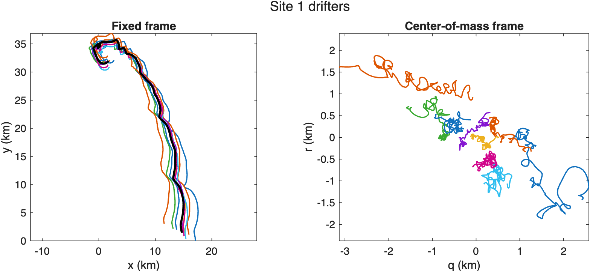

# Gridded streamfunction fit

Fit a zero-vorticity gridded streamfunction to the Site 1 LatMix drifter cluster and inspect the fitted decomposition.

Source: `Examples/Tutorials/GriddedStreamfunctionFit.m`

## Load the Site 1 drifters

`GriddedStreamfunction` fits one common background path, one centered
mesoscale streamfunction, and one submesoscale residual per drifter so
that

$$ \dot{x}_k = u^{\mathrm{meso}} + u^{\mathrm{bg}} + u_k^{\mathrm{sm}}, \qquad \dot{y}_k = v^{\mathrm{meso}} + v^{\mathrm{bg}} + v_k^{\mathrm{sm}}. $$

This tutorial uses the checked-in Site 1 LatMix drifter cluster and
fits a zero-vorticity mesoscale model from the sampled trajectories.

```matlab
scriptDir = fileparts(mfilename("fullpath"));
dataPath = fullfile(scriptDir, "..", "..", "Estimation", "ExampleData", "LatMix2011", "smoothedGriddedRho1Drifters.mat");
if ~isfile(dataPath)
    error("GriddedStreamfunction:MissingExampleData", "Expected local example data at %s.", dataPath);
end

siteData = load(dataPath);
t = reshape(siteData.t, [], 1);
x = siteData.x(:, 1:(end - 1));
y = siteData.y(:, 1:(end - 1));
nDrifters = size(x, 2);
tDays = t/86400;
f0 = 2 * 7.2921e-5 * sin(siteData.lat0*pi/180);
```

## Convert the drifters to trajectory splines

Each drifter becomes one cubic `TrajectorySpline`, so the estimator
works with both positions and spline-derived velocities on the same
support times.

```matlab
trajectoryCell = cell(nDrifters, 1);
for iDrifter = 1:nDrifters
    trajectoryCell{iDrifter} = TrajectorySpline.fromData(t, x(:, iDrifter), y(:, iDrifter), S=3);
end
trajectories = vertcat(trajectoryCell{:});
```

## Fit a zero-vorticity mesoscale model

The Site 1 tutorial uses a quadratic-in-space, cubic-in-time mesoscale
spline basis together with `mesoscaleConstraint="zeroVorticity"`, which
keeps the fitted mesoscale flow harmonic in the centered frame.

```matlab
fit = GriddedStreamfunction.fromTrajectories( ...
    trajectories, psiS=[2 2 3], fastS=3, mesoscaleConstraint="zeroVorticity");
decomposition = fit.decomposition;
```

## View the drifters in the fixed and centered frames

The fitted center-of-mass trajectory defines the centered coordinates

$$ q_k = x_k - m_x(t), \qquad r_k = y_k - m_y(t), $$

which remove the common translation and leave the relative motion seen
by the mesoscale spline.

```matlab
figure(Color="w", Position=[100 100 860 360]);
tlFrames = tiledlayout(1, 2, TileSpacing="compact", Padding="compact");

axFixed = nexttile;
hold(axFixed, "on")
for iDrifter = 1:nDrifters
    trajectory = fit.observedTrajectories(iDrifter);
    ti = trajectory.t;
    plot(axFixed, trajectory.x(ti)/1000, trajectory.y(ti)/1000, LineWidth=1.2);
end
plot(axFixed, fit.centerOfMassTrajectory.x(t)/1000, fit.centerOfMassTrajectory.y(t)/1000, "k", LineWidth=2);
axis(axFixed, "equal")
xlabel(axFixed, "x (km)")
ylabel(axFixed, "y (km)")
title(axFixed, "Fixed frame")
box(axFixed, "on")

axCentered = nexttile;
hold(axCentered, "on")
for iDrifter = 1:nDrifters
    trajectory = fit.observedTrajectories(iDrifter);
    ti = trajectory.t;
    xi = trajectory.x(ti);
    yi = trajectory.y(ti);
    [~, qi, ri] = fit.centeredCoordinates(ti, xi, yi);
    plot(axCentered, qi/1000, ri/1000, LineWidth=1.2);
end
axis(axCentered, "equal")
xlabel(axCentered, "q (km)")
ylabel(axCentered, "r (km)")
title(axCentered, "Center-of-mass frame")
box(axCentered, "on")

title(tlFrames, "Site 1 drifters")
```



*In the fixed frame the Site 1 cluster translates together, while the center-of-mass frame removes that drift and reveals the coherent relative motion used by the mesoscale fit.*

## Inspect the fitted diagnostics

Evaluating the fit on the center-of-mass path gives a compact summary of
the recovered strain, background drift, and the near-zero mesoscale
vorticity implied by the chosen constraint.

```matlab
xCom = fit.centerOfMassTrajectory.x(t);
yCom = fit.centerOfMassTrajectory.y(t);
sigmaN = fit.sigma_n(t, xCom, yCom);
sigmaS = fit.sigma_s(t, xCom, yCom);
sigma = hypot(sigmaN, sigmaS);
zeta = fit.zeta(t, xCom, yCom);
thetaDegrees = GriddedStreamfunction.visualPrincipalStrainAngle(sigmaN, sigmaS);
uBackground = fit.uBackground(t);
vBackground = fit.vBackground(t);

figure(Color="w", Position=[100 100 700 560]);
tlDiagnostics = tiledlayout(3, 1, TileSpacing="compact", Padding="compact");

axRate = nexttile;
plot(axRate, tDays, sigma/f0, LineWidth=1.5)
hold(axRate, "on")
plot(axRate, tDays, zeta/f0, LineWidth=1.5)
ylabel(axRate, "rate / f_0")
xlim(axRate, [tDays(1), tDays(end)])
legend(axRate, "\sigma", "\zeta", Location="best")
box(axRate, "on")
title(axRate, "Zero-vorticity diagnostics")

axTheta = nexttile;
plot(axTheta, tDays, thetaDegrees, LineWidth=1.5)
ylabel(axTheta, "\theta (deg)")
xlim(axTheta, [tDays(1), tDays(end)])
box(axTheta, "on")

axBackground = nexttile;
plot(axBackground, tDays, uBackground, LineWidth=1.5)
hold(axBackground, "on")
plot(axBackground, tDays, vBackground, LineWidth=1.5)
xlabel(axBackground, "time (days)")
ylabel(axBackground, "u_bg, v_bg (m/s)")
xlim(axBackground, [tDays(1), tDays(end)])
legend(axBackground, "u_bg", "v_bg", Location="best")
box(axBackground, "on")

title(tlDiagnostics, "Fitted diagnostics")
```


*The zero-vorticity fit retains a time-varying strain field and background drift while keeping the mesoscale relative vorticity near zero along the fitted center-of-mass path.*

## Show the fixed-frame decomposition

The fixed-frame decomposition stores a common background path together
with one mesoscale and one submesoscale trajectory for each drifter.

```matlab
backgroundX = fit.backgroundTrajectory.x(t);
backgroundY = fit.backgroundTrajectory.y(t);

figure(Color="w", Position=[100 100 1080 340]);
tlDecomposition = tiledlayout(1, 3, TileSpacing="none", Padding="compact");

axBackgroundPath = nexttile;
plot(axBackgroundPath, backgroundX/1000, backgroundY/1000, "k", LineWidth=1.5)
axis(axBackgroundPath, "equal")
xlabel(axBackgroundPath, "x (km)")
ylabel(axBackgroundPath, "y (km)")
title(axBackgroundPath, "Common background path")
box(axBackgroundPath, "on")

axMesoscale = nexttile;
hold(axMesoscale, "on")
mesoscaleX = [];
mesoscaleY = [];
for iDrifter = 1:nDrifters
    trajectory = fit.observedTrajectories(iDrifter);
    ti = trajectory.t;
    mesoscale = decomposition.fixedFrame.mesoscale(iDrifter);
    xMeso = mesoscale.x(ti);
    yMeso = mesoscale.y(ti);
    mesoscaleX = [mesoscaleX; xMeso]; %#ok<AGROW>
    mesoscaleY = [mesoscaleY; yMeso]; %#ok<AGROW>
    plot(axMesoscale, xMeso/1000, yMeso/1000, LineWidth=1.2)
end
axis(axMesoscale, "equal")
xlabel(axMesoscale, "x (km)")
xlim(axMesoscale, paddedLimits(mesoscaleX/1000))
ylim(axMesoscale, paddedLimits(mesoscaleY/1000))
title(axMesoscale, "Fixed-frame mesoscale")
axMesoscale.YTickLabel = [];
box(axMesoscale, "on")

axSubmesoscale = nexttile;
hold(axSubmesoscale, "on")
submesoscaleX = [];
submesoscaleY = [];
for iDrifter = 1:nDrifters
    trajectory = fit.observedTrajectories(iDrifter);
    ti = trajectory.t;
    submesoscale = decomposition.fixedFrame.submesoscale(iDrifter);
    xSubmeso = submesoscale.x(ti);
    ySubmeso = submesoscale.y(ti);
    submesoscaleX = [submesoscaleX; xSubmeso]; %#ok<AGROW>
    submesoscaleY = [submesoscaleY; ySubmeso]; %#ok<AGROW>
    plot(axSubmesoscale, xSubmeso/1000, ySubmeso/1000, LineWidth=1.2)
end
axis(axSubmesoscale, "equal")
xlabel(axSubmesoscale, "x (km)")
xlim(axSubmesoscale, paddedLimits(submesoscaleX/1000))
ylim(axSubmesoscale, paddedLimits(submesoscaleY/1000))
title(axSubmesoscale, "Fixed-frame submesoscale")
axSubmesoscale.YTickLabel = [];
box(axSubmesoscale, "on")

title(tlDecomposition, "Trajectory decomposition")
```


*The fitted decomposition separates one common translating background path from the coherent mesoscale motion and the smaller drifter-to-drifter residual excursions.*

## Check one drifter in velocity space

For an individual drifter, the spline-derived velocity is reconstructed
directly from the fitted component velocities,

$$ \mathbf{u}^{\mathrm{obs}}_k = \mathbf{u}^{\mathrm{bg}} + \mathbf{u}^{\mathrm{meso}}_k + \mathbf{u}^{\mathrm{sm}}_k. $$

```matlab
iDrifter = 1;
trajectory = fit.observedTrajectories(iDrifter);
ti = trajectory.t;
background = decomposition.fixedFrame.background(iDrifter);
mesoscale = decomposition.fixedFrame.mesoscale(iDrifter);
submesoscale = decomposition.fixedFrame.submesoscale(iDrifter);

uObserved = trajectory.u(ti);
vObserved = trajectory.v(ti);
uBackgroundDrifter = background.u(ti);
vBackgroundDrifter = background.v(ti);
uMesoscale = mesoscale.u(ti);
vMesoscale = mesoscale.v(ti);
uSubmesoscale = submesoscale.u(ti);
vSubmesoscale = submesoscale.v(ti);
uReconstruction = uBackgroundDrifter + uMesoscale + uSubmesoscale;
vReconstruction = vBackgroundDrifter + vMesoscale + vSubmesoscale;

fprintf("Site 1 zero-vorticity fit\n");
fprintf("  drifters: %d\n", nDrifters);
fprintf("  max |zeta/f0| on COM path: %.3e\n", max(abs(zeta/f0)));
fprintf("  drifter %d max |u-u_recon|: %.3e m/s\n", iDrifter, max(abs(uObserved - uReconstruction)));
fprintf("  drifter %d max |v-v_recon|: %.3e m/s\n", iDrifter, max(abs(vObserved - vReconstruction)));

figure(Color="w", Position=[100 100 760 420]);
tlVelocity = tiledlayout(2, 1, TileSpacing="compact", Padding="compact");

axU = nexttile;
hold(axU, "on")
scatter(axU, ti/86400, uObserved, 5^2, "k", "filled", DisplayName="observed")
plot(axU, ti/86400, uReconstruction, "k", LineWidth=1.5, DisplayName="reconstruction")
plot(axU, ti/86400, uMesoscale, LineWidth=1.5, Color=[0 0.4470 0.7410], DisplayName="mesoscale")
plot(axU, ti/86400, uBackgroundDrifter, LineWidth=1.5, Color=[0.8500 0.3250 0.0980], DisplayName="background")
plot(axU, ti/86400, uSubmesoscale, LineWidth=1.5, Color=[0.4660 0.6740 0.1880], DisplayName="submesoscale")
ylabel(axU, "u (m/s)")
xlim(axU, [tDays(1), tDays(end)])
legend(axU, Location="best")
box(axU, "on")

axV = nexttile;
hold(axV, "on")
scatter(axV, ti/86400, vObserved, 5^2, "k", "filled", DisplayName="observed")
plot(axV, ti/86400, vReconstruction, "k", LineWidth=1.5, DisplayName="reconstruction")
plot(axV, ti/86400, vMesoscale, LineWidth=1.5, Color=[0 0.4470 0.7410], DisplayName="mesoscale")
plot(axV, ti/86400, vBackgroundDrifter, LineWidth=1.5, Color=[0.8500 0.3250 0.0980], DisplayName="background")
plot(axV, ti/86400, vSubmesoscale, LineWidth=1.5, Color=[0.4660 0.6740 0.1880], DisplayName="submesoscale")
xlabel(axV, "time (days)")
ylabel(axV, "v (m/s)")
xlim(axV, [tDays(1), tDays(end)])
legend(axV, Location="best")
box(axV, "on")

title(tlVelocity, sprintf("Velocity decomposition for drifter %d", iDrifter))
```


*For an individual drifter, the fitted background, mesoscale, and submesoscale velocities add back to the observed spline-derived velocity at the sample times.*
