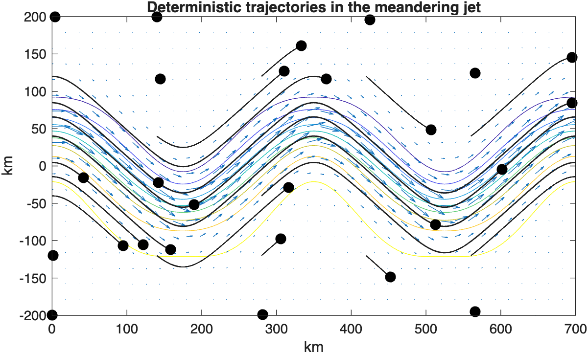
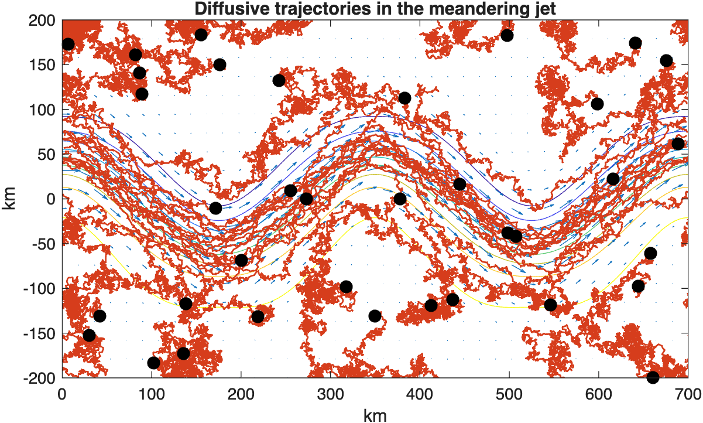
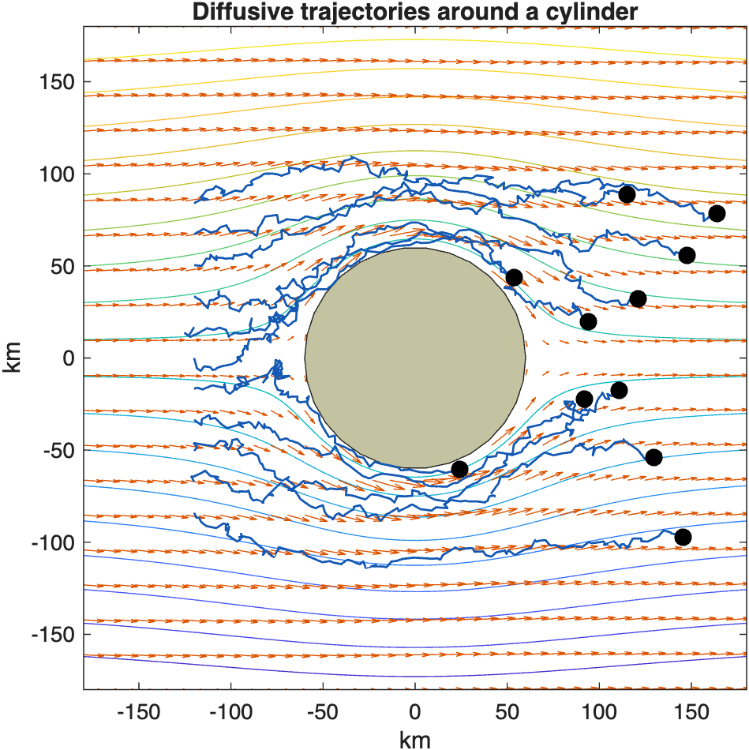

# Integrating stochastic trajectories in kinematic models

Compare deterministic and diffusive particle trajectories in the meandering jet and cylinder-flow kinematic models.

Source: `Examples/Tutorials/IntegratingStochasticTrajectories.m`

## Set up the model and integration rule

`AdvectionDiffusionIntegrator` advances particle positions according to

$$ d\mathbf{r}(t) = \mathbf{u}(t,\mathbf{r})\,dt + \sqrt{2\kappa}\,d\mathbf{W}_t, $$

where $$\mathbf{u}(t,\mathbf{r})$$ comes from a `KinematicModel` and
$$\kappa$$ is the scalar diffusivity. When `kappa = 0`, the stochastic
term vanishes and the trajectories reduce to deterministic advection.

Over one short timestep $$\Delta t$$, the package applies the same idea
in discrete form,

$$ \mathbf{r}_{n+1} \approx \mathbf{r}_n + \mathbf{u}(t_n,\mathbf{r}_n)\Delta t + \sqrt{2\kappa\Delta t}\,\mathbf{z}_n, \qquad \mathbf{z}_n \sim \mathcal{N}(0, I). $$

The deterministic drift is advanced by the existing integrator machinery,
and the stochastic increment is added through the diffusivity integrator
path.

```matlab
jet = MeanderingJet();
T = 5 * jet.Lx / jet.U;
dt = 864;
[x0Jet, y0Jet] = meanderingJetInitialPositions(jet);
```

## Deterministic trajectories in the meandering jet

Start with `kappa = 0` so that the particle paths follow only the jet
velocity field. This is the same integration call used in the diffusive
cases below; only the diffusivity changes.

```matlab
deterministicIntegrator = AdvectionDiffusionIntegrator(jet, 0);
[~, xDeterministic, yDeterministic] = deterministicIntegrator.particleTrajectories(x0Jet, y0Jet, T, dt);

figure(Position=[100 100 780 360])
jet.plotStreamfunction()
hold on
jet.plotVelocityField(numPoints=20)
jet.plotTrajectories(xDeterministic, yDeterministic, Color=[0.12 0.12 0.12], LineWidth=1.0)
title("Deterministic trajectories in the meandering jet")
```



*With zero diffusivity, particles stay locked to the organized pathways of the meandering jet and retain sharp transport structure.*

## Add diffusivity in the same meandering jet

Now keep the same velocity field and initial conditions, but add scalar
diffusivity. A fixed random seed keeps the tutorial figure reproducible.

```matlab
rng(7)
diffusiveIntegrator = AdvectionDiffusionIntegrator(jet, 1e3);
[~, xDiffusive, yDiffusive] = diffusiveIntegrator.particleTrajectories(x0Jet, y0Jet, T, dt);

figure(Position=[100 100 780 360])
jet.plotStreamfunction()
hold on
jet.plotVelocityField(numPoints=20)
jet.plotTrajectories(xDiffusive, yDiffusive, Color=[0.84 0.24 0.11], LineWidth=1.0)
title("Diffusive trajectories in the meandering jet")
```



*Adding diffusivity broadens the same initial particle set while keeping the organized meandering-jet pathways visible.*

## Diffusive trajectories around an obstacle

The same integration call also works when the model contains an obstacle.
In `CylinderFlow`, the mean drift bends around the cylinder while
diffusivity perturbs nearby paths as they pass the boundary.

```matlab
cylinder = CylinderFlow();
Tcylinder = 4 * cylinder.R / cylinder.U;
dtCylinder = 1800;
[x0Cylinder, y0Cylinder] = cylinderInitialPositions(cylinder);

rng(11)
cylinderIntegrator = AdvectionDiffusionIntegrator(cylinder, 1e3);
[~, xCylinder, yCylinder] = cylinderIntegrator.particleTrajectories(x0Cylinder, y0Cylinder, Tcylinder, dtCylinder);

figure(Position=[100 100 520 500])
cylinder.plotStreamfunction()
hold on
cylinder.plotVelocityField(numPoints=20)
cylinder.plotTrajectories(xCylinder, yCylinder, Color=[0.08 0.35 0.70], LineWidth=1.0)
title("Diffusive trajectories around a cylinder")
```



*The cylinder obstacle redirects the mean flow while diffusivity spreads neighboring trajectories around the boundary and into the wake.*
